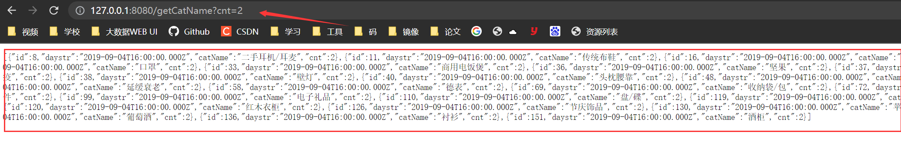

js 连接 mysql数据池

首先安装mysql ，express，body-parser ， cors

```js
// 接口文件

const mysql = require('mysql');

const pool = mysql.createPool({
    host:"localhost",
    user:"root",
    password:"root",
    port:"3306",
    database:"itcast_shop_bi"
});
pool.on('connection', (connection) => {
    //logger.info("connection!");
});

pool.on('enqueue', () => {
    //logger.info('Waiting for available connection slot');
});

module.exports.Pool = pool;

module.exports.getConnection = (cb) => {
    if (typeof cb == "function") {
        pool.getConnection(function (err, connection) {
            cb(err, connection);
        });
    } else {
        return new Promise((resolve, reject) => {
            pool.getConnection((err, connection) => {
                if (err) {
                    reject(err);
                } else {
                    resolve(connection);
                }
            });
        });
    }
};
module.exports.exec = (sql, values, cb) => {
    if (typeof cb == "function") {
        pool.getConnection((err, connection) => {
            if (err) {
                connection.release();
                cb(err);
            } else {
                connection.query(sql, values, (error, rows) => {
                    connection.release();
                    cb(error, rows);
                });
            }
        });
    } else {
        return new Promise((resolve, reject) => {
            pool.getConnection((err, connection) => {
                if (err) {
                    connection.release();
                    reject(err);
                } else {
                    connection.query(sql, values, (error, rows) => {
                        connection.release();
                        if (error)
                            reject(error);
                        else
                            resolve(rows);
                    });
                }
            });
        });
    }
};
module.exports.beginTransaction = (connection, cb) => {
    if (typeof cb == "function") {
        connection.beginTransaction(function (err) {
            if (err) {
                throw err;
            }
            cb(null, connection);
        });
    } else {
        return new Promise((resolve, reject) => {
            connection.beginTransaction(function (err) {
                if (err) {
                    reject(err);
                } else {
                    resolve(connection);
                }
            });
        });
    }
};
module.exports.rollback = (connection, cb) => {
    if (typeof cb == "function") {
        connection.rollback(function () {
            connection.release();
            cb && cb();
        });
    } else {
        return new Promise((resolve, reject) => {
            connection.rollback(function (err) {
                connection.release();
                if (err) {
                    reject(err);
                } else {
                    resolve();
                }
            });
        });
    }
};
module.exports.commit = (connection, cb) => {
    if (typeof cb == "function") {
        connection.commit(function (err) {
            if (err) {
                connection.rollback(function () {
                    cb && cb(err);
                    throw err;
                });
            }
            connection.release();
            cb && cb();
        });
    } else {
        return new Promise((resolve, reject) => {
            connection.commit(function (err) {
                if (err) {
                    connection.rollback(function () {
                        reject(err);
                    });
                }
                connection.release();
                resolve();
            });
        });
    }
};
//检查是否链接失败
this.getConnection((err, connection) => {
    if (err) throw err;
    else {
        // logger.info("connected success!");
        connection.release();
    }
});

/**
 * 带事务
 * @param sql
 * @param values
 * @returns {Promise}
 */
module.exports.exec2 = (connection, sql, values, cb) => {
    if (typeof cb == "function") {
        connection.query(sql, values, (error, rows) => {
            cb(error, rows);
        });
    } else {
        return new Promise((resolve, reject) => {
            connection.query(sql, values, (error, rows) => {
                if (error)
                    reject(error);
                else
                    resolve(rows);
            });
        });
    }
};

```

前端查询示例

```js
const express = require("express");
//引入封装好的mysql文件
const db = require("./test");

const server =express();


// get请求，要拿到前端传过来的数据，使用query
// post请求，传到前端去的数据，使用body
server.get("/getCatName",async(request,response,next)=>{
    let cnt = request.query.cnt;
    let params = [cnt];
    let sql = "SELECT * FROM app_cat_cnt WHERE cnt = ?;";
    let result = await db.exec(sql,params);

    response.json(result);
})

server.listen(8080,()=>{
    console.log("服务器启动完毕！");
})
```

