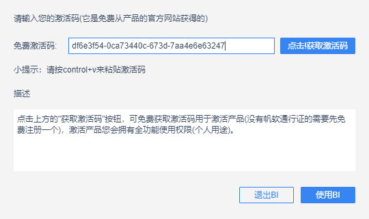
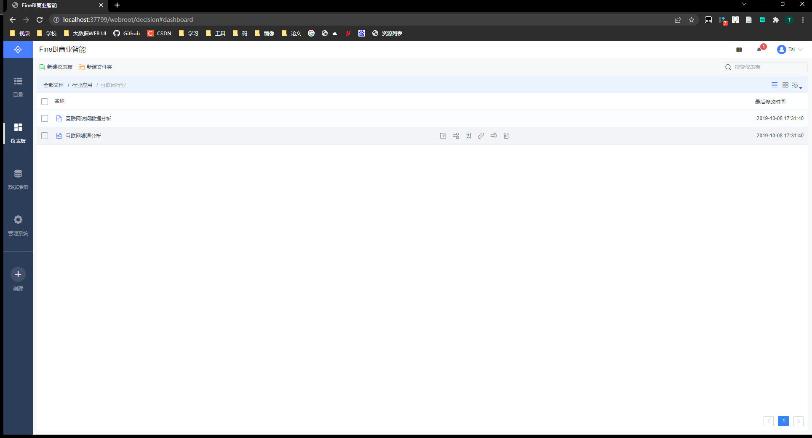

## 商业可视化平台FineBI

### 1、介绍

```
FineBI 是帆软软件有限公司推出的一款商业智能（Business Intelligence）产品。
FineBI 是定位于自助大数据分析的 BI 工具，能够帮助企业的业务人员和数据分析师，开展以问题导向的探索式分析。
```


### 2、优势

- 通过多人协作来实现最终的可视化构建

- FineBI不需要通过复杂代码来实现开发，通过可视化操作实现开发

- 功能非常的强大

  - 适合于各种数据可视化的应用场景

  - 各种常见的分析图表

  - 支持各种各样的数据源

  - 支持处理大数据

    

### 3、部署

- 8G以上可以配置4096JVM
- 需要官网注册获取免费激活码（个人用途）



df6e3f54-0ca73440c-673d-7aa4e6e63247

