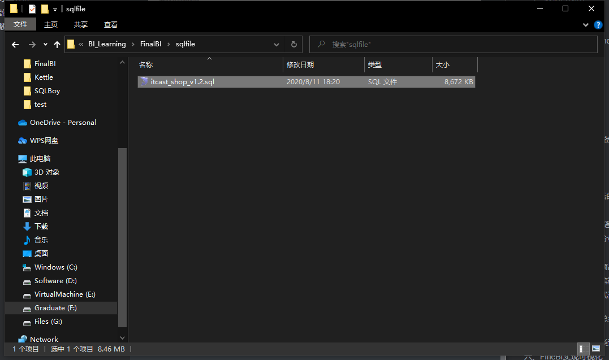
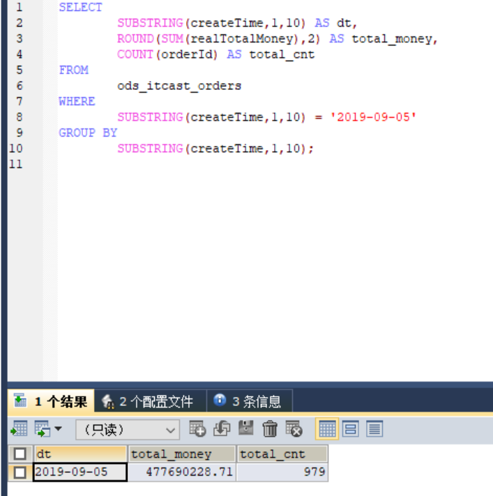
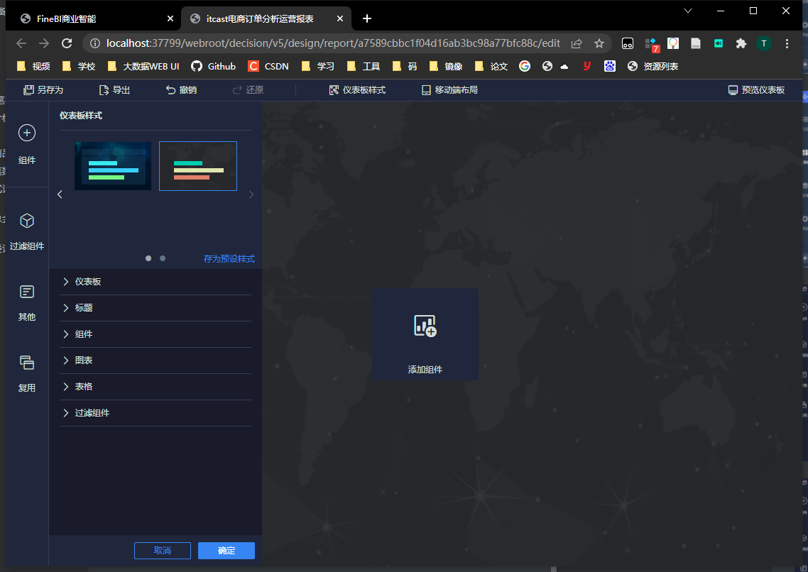

## 一、订单分析案例背景

本案例基于MySQL数据库，使用Kettle、帆软FineBI实现数据可视化。案例使用MySQL作为数据分析的存储以及查询引擎、以Kettle作为数据处理脚本执行工具、以及FineBI实现数据可视化展示。让同学们将来能够快速实现数据分析、以及可视化开发。

### 1、电商业务

- 用户行为
  - 浏览商品
  - 登录注册
  - 添加购物车
  - 收藏商品
  - 下订单购买
- 产生数据
  - ip：用于上网的IP
  - userid：用户id
  - useragent：客户端信息：浏览器名称、版本、操作系统名称、版本
  - pid：正在访问商品 id
  - url：正在访问的页面
  - ref_url：从哪个页面进入的
  - orderId：订单id
  - payType：支付方式
  - price：支付金额
  - ……
- 电商后台分析
  - 用户分析
    - 总用户个数
    - 新增用户个数
    - 用户的来源比例
    - 用户的客户端比例
    - 流失用户
    - 回流用户
    - 跳出用户
  - 访问分析
    - 访问量最多的网页，前10名
    - 商品销量的前10名
    - 商品浏览的前10名
    - 商品收藏的前10名
  - 分析作用
    - 用于发现用户的喜好，给用户提供更好的服务
    - 用于发现整个平台存在的问题，改善平台的流程、设计、让更多的用户喜欢这个平台

### 2、订单分析

- 订单数据的生成
  - 用户在平台上下订单  =>   订单存储在这个平台的数据库中
  - 订单业务数据库：专门用于提供对于用户的订单的提交和查询
- 订单中包含的数据
  - orderid：订单id
  - userid：用户id
  - productId：商品id
  - 商品名称
  - 商品分类
  - 订单金额
  - 商品个数
  - 支付方式
  - 配送地址
  - 订单生成时间
  - ……
- 实现订单分析
  - 订单的总金额
  - 订单的总个数
  - 不同省份订单的比例
  - 退款订单的个数
  - 发货订单的个数
  - ……

## 二、案例架构及数据准备

### 1、架构


- 业务订单数据

  - MySQL数据库：itcast_shop
  - 用于对外支撑业务：下订单、查询订单

- ETL

  - Kettle：过滤、转换、补全

- 待分析的数据

  - MySQL数据库：itcast_shop_bi
  - 用于实现数据分析：订单分析

- 分析的结果

  - MySQL实现分析：itcast_shop_bi

  - FineBI：实现可视化报表构建

    

### 2、数据准备

- 将业务订单数据导入到MySQL中

  - step1：找到数据对应的SQL文件	

  - step2：导入sql文件

    

    

  - 创建用于分析的数据库

    ```sql
    create database if not exists itcast_shop_bi  DEFAULT CHARACTER SET utf8;
    ```

| **表名**            | **说明**                                                     |
| ------------------- | ------------------------------------------------------------ |
| itcast_areas        | 用于存储地址：省份、城市、地区【区、县】                     |
| itcast _goods       | 商品表，记录了所有商品信息：id、名称、价格、上架时间、三级分类 |
| itcast _goods_cats  | 商品分类：商品一级、二级、三级                               |
| itcast _orders      | 订单表，记录了所有订单信息：订单id、用户id、订单金额         |
| itcast _order_goods | 订单商品表：记录了订单与商品的关系：订单id、商品id           |
| itcast _users       | 用户表，记录了所有用户的信息：用户id、用户名称等             |

### 3、Kettle实现ETL


- 需求：将itcast_shop数据库中每张表的最新数据同步到itcast_shop_bi中，每天同步一次

- 每天分析昨天的数据
  - 昨天的最新数据存储itcast_shop数据库中
  - 将最新的数据同步到itcast_shop_bi中用于分析
- 每天在分析之前，先同步一次
- 用Kettle实现：每天自动同步itcast_shop中最新的数据存入itcast_shop_bi中


```sql
select *, current_date() # 可以添加插入时间
```


表同步示例如上，这里使用已经完成的ods数据库


## 三、MySQL分析开发

### 1、每日订单总额/总笔数分析

- 需求：统计每天的订单的总金额和总个数
- 分析：对订单表的数据进行统计

  - id：自动增长的一个数字，唯一标识一条数据，从1开始
    - 第一条数据：1
    - 第二条数据：2
  - dt：日期
  - total_money：总金额
  - total_cnt：总个数
- 创建结果表：app_order_total

```sql
create table app_order_total(
	id int primary key auto_increment,
    # primary key 定义主键，唯一不能相同， auto_increment 自动增长
    dt date,
    total_money double,
    total_cnt int
);
```

- 实现分析

  - substring：截取数据

  - round：指定保留几位小数

```sql
select
	substring(createTime,1,10) as dt,
	#substring(str,pos,len),截取str从pos开始的len个字符
	round(sum(realTotalMoney),2) as total_money,
	count(orderId) as total_cnt
from
	ods_itcast_orders
where 
	substring(createTime,1,10) = '2019-09-05'
group by
	substring(createTime,1,10);
	
```



- 保存结果

```sql
insert into app_order_total
select
  null,
  substring(createTime,1,10) as dt,
  round(sum(realTotalMoney),2) as total_money,
  count(orderId) as total_cnt
from
  ods_itcast_orders
where
  substring(createTime,1,10) = '2019-09-05'
group by
  substring(createTime,1,10);
```


### 2、下订单用户总数分析

- 需求：统计所有下订单的用户的总个数

- 分析

  - 基于订单表进行分析
  - 订单表中：订单对应的用户id
  - 对订单表中的用户id去重统计个数

- 实现

  ```sql
  select
  	substring(createTime,1,10) as dt,
  	count(distinct userId) as total_user_cnt
  from
  	ods_itcast_orders
  group by
  	substring(createTime,1,10);
  ```

- 建表

  ```sql
  create table app_order_user(
      id int primary key auto_increment,
      dt date,
      total_user_cnt int
  );
  ```

- 保存

  ```sql
  insert into app_order_user
  select
      null,
      substring(createTime,1,10) as dt,
      count(distinct userId) as total_user_cnt
  from
      ods_itcast_orders
  group by
      substring(createTime,1,10);
  ```

### 3、 热门商品top10

- 需求：统计所有订单中哪些商品被购买的次数最多的前10名

- 分析

  - 统计每个商品对应的订单个数
  - 按照个数降序排序
  - 取前10 
  - 结果：
    - 商品名称      订单个数
  - 订单商品表中：订单id、商品id
  - 商品表：商品id、商品名称
  - 用商品id做关联，统计每个商品对应的订单个数

- 实现

  ```sql
  select
     substring(a.createtime,1,10) as dt,
     b.goodsName,
     count(*) as cnt
  from
      ods_itcast_order_goods a join ods_itcast_goods b  on  a.goodsId = b.goodsId
  group by
      b.goodsName,substring(a.createtime,1,10)
  order by
      cnt desc
  limit 10;
  ```

  

- 建表

  ```sql
  create table app_goods_top10(
      id int primary key auto_increment,
      dt date,
      goodsName varchar(100),
      cnt int
  );
  ```

- 保存

  ```sql
  insert  into app_goods_top10
  select
     null,
     substring(a.createtime,1,10) as dt,
     b.goodsName,
     count(*) as cnt
  from
      ods_itcast_order_goods a join ods_itcast_goods b  on  a.goodsId = b.goodsId
  group by
      b.goodsName,substring(a.createtime,1,10)
  order by
      cnt desc
  limit 10;
  ```

### 4、每天每小时上架商品个数 

- 需求：统计每天每个小时上架的商品个数

- 分析：根据商品上架时间进行分组统计

  - 商品表

- 实现

  ```sql
  select
      substring(createTime,1,10) as daystr,
      substring(createTime,12,2) as hourstr,
      count(*) cnt
  from
      ods_itcast_goods
  group by
      substring(createTime,1,10),substring(createTime,12,2)
  order by daystr,hourstr;
  ```

  

- 建表

  ```sql
  create table app_hour_goods(
      id int primary key auto_increment,
      daystr date,
      hourstr varchar(10),
      cnt int
  );
  ```

- 保存

  ```sql
  insert  into app_hour_goods
  select
      null,
      substring(createTime,1,10) as daystr,
      substring(createTime,12,2) as hourstr,
      count(*) cnt
  from
      ods_itcast_goods
  group by
      substring(createTime,1,10),substring(createTime,12,2)
  order by daystr,hourstr;
  ```


### 5、每天每小时订单笔数 

- 需求：统计每天每个小时订单的个数

- 分析：统计订单表

  - 对天和小时分组
  - 统计订单id的个数

- 实现

  ```sql
  select
      substring(createTime,1,10) as daystr,
      substring(createTime,12,2) as hourstr,
      count(orderId) as cnt
  from
     ods_itcast_orders
  group by
     substring(createTime,1,10),substring(createTime,12,2)
  order by
     daystr,hourstr;
  ```

  

- 建表

  ```sql
  create table app_hour_orders(
      id int primary key auto_increment,
      daystr date,
      hourstr varchar(10),
      cnt int
  );
  ```

  

- 保存

  ```sql
  insert  into app_hour_orders
  select
      null,
      substring(createTime,1,10) as daystr,
      substring(createTime,12,2) as hourstr,
      count(orderId) as cnt
  from
     ods_itcast_orders
  group by
     substring(createTime,1,10),substring(createTime,12,2)
  order by
     daystr,hourstr;
  ```

  


### 6、每天不同支付方式订单总额/订单笔数

- 需求：统计每天不同的支付方式对应的订单总金额以及订单总笔数

- 分析：订单表中有支付方式这一列

  - 现金
  - 支付宝
  - 微信
  - ……
  - 按照日期和支付方式分组统计总金额和总笔数

- 实现

  - case  when：做判断，根据这一列的值不同，可以显示不同 内容
    - case  列 
      - when  v1  then   r1
      - when  v2  then r2
      - ……
      - else   rN
      - end

  ```sql
  select
      substring(createTime,1,10) as dt,
      case payType when 1 then '支付宝' when 2 then '微信' when 3 then '现金' else '其他' end as pay_type,
      round(sum(realTotalMoney),2) as total_money,
      count(orderId) as total_cnt
  from
      ods_itcast_orders
  group by
      substring(createTime,1,10),
      payType;
  ```

  

- 建表

  ```sql
  create table app_order_paytype(
      id int primary key auto_increment,
      dt date,
      pay_type varchar(100),
      total_money double,
      total_cnt int
  );
  ```

  

- 保存

  ```sql
  insert into app_order_paytype
  select
      null,
      substring(createTime,1,10) as dt,
      case payType when 1 then '支付宝' when 2 then '微信' when 3 then '现金' else '其他' end as pay_type,
      round(sum(realTotalMoney),2) as total_money,
      count(orderId) as total_cnt
  from
      ods_itcast_orders
  group by
      substring(createTime,1,10),
      payType;
  ```


### 7、每天各省份订单总金额、订单总笔数  

- 需求：统计每天每个省份的订单总金额以及订单总个数

- 分析：需要按照天和省份分组统计金额和个数

  - 订单表：订单金额、订单id、订单日期、areaId：省份id
  - 地区表：地区id、地区名称
  - 两张表关联

- 实现

  ```sql
  select
      substring(a.createTime,1,10) as dt,
      b.areaName,
      round(sum(realTotalMoney)) as total_money,
      count(orderId) as total_cnt
  from
      ods_itcast_orders a join ods_itcast_area b on a.areaId = b.areaId
  group by
      substring(a.createTime,1,10),b.areaName;
  ```

  

- 建表

  ```sql
  create table app_order_province(
      id int primary key auto_increment,
      daystr date,
      province varchar(100),
      total_money double,
      total_cnt int
  );
  ```

  

- 保存

  ```sql
  insert into app_order_province
  select
      null,
      substring(a.createTime,1,10) as dt,
      b.areaName,
      round(sum(realTotalMoney)) as total_money,
      count(orderId) as total_cnt
  from
      ods_itcast_orders a join ods_itcast_area b on a.areaId = b.areaId
  group by
      substring(a.createTime,1,10),b.areaName;
  ```

  

### 8、每天不同商品分类订单个数统计

- 需求：统计每天不同商品分类对应订单的个数

- 分析

  - 订单商品表：订单id、商品id   =>  统计订单个数
  - 商品表：商品id、商品分类id
  - 商品分类表：商品分类id、商品分类名称 

- 实现

  ```sql
  select
      substring(a.createtime,1,10) as daystr,
      c.catName,
      count(*) as cnt
  from
       ods_itcast_order_goods a join ods_itcast_goods b  on a.goodsId = b.goodsId
       join ods_itcast_good_cats c on b.goodsCatId =c.catId
  group by
       substring(a.createtime,1,10),c.catName;
  ```

  

- 建表

  ```sql
  create table app_cat_cnt(
      id int primary key auto_increment,
      daystr date,
      catName varchar(100),
      cnt int
  );
  
  ```

  

- 保存

  ```sql
  insert  into app_cat_cnt
  select
      null,
      substring(a.createtime,1,10) as daystr,
      c.catName,
      count(*) as cnt
  from
       ods_itcast_order_goods a join ods_itcast_goods b  on a.goodsId = b.goodsId
       join ods_itcast_good_cats c on b.goodsCatId =c.catId
  group by
       substring(a.createtime,1,10),c.catName;
  ```

  

## 四、FineBI实现可视化

### 1、构建连接


### 2、配置数据


### 3、构建仪表盘





### 4、配置图表

- 每日订单总数

  


- 热门商品


- 时段上新


- 时段订单


- 支付方式


- 省份订单总额和订单数


- 订单分类搜索词云图

