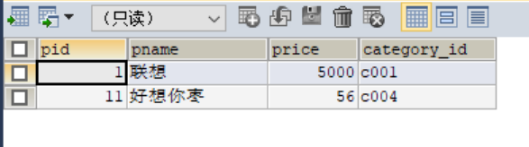

# SQL分析之DQL

## 1、准备数据

- 创建测试数据库

  ```SQL
  drop database if exists bigdata;
  create database bigdata;
  use bigdata;
  ```

- 创建商品表

  ```sql
  create table product(
   pid int,
   pname varchar(20),
   price double,
   category_id varchar(32)
  );
  ```

- 插入商品测试数据

  ```sql
  INSERT INTO product(pid,pname,price,category_id) VALUES(1,'联想',5000,'c001');
  INSERT INTO product(pid,pname,price,category_id) VALUES(2,'海尔',3000,'c001');
  INSERT INTO product(pid,pname,price,category_id) VALUES(3,'雷神',5000,'c001');
  INSERT INTO product(pid,pname,price,category_id) VALUES(4,'杰克琼斯',800,'c002');
  INSERT INTO product(pid,pname,price,category_id) VALUES(5,'真维斯',200,'c002');
  INSERT INTO product(pid,pname,price,category_id) VALUES(6,'花花公子',440,'c002');
  INSERT INTO product(pid,pname,price,category_id) VALUES(7,'劲霸',2000,'c002');
  INSERT INTO product(pid,pname,price,category_id) VALUES(8,'香奈儿',800,'c003');
  INSERT INTO product(pid,pname,price,category_id) VALUES(9,'相宜本草',200,'c003');
  INSERT INTO product(pid,pname,price,category_id) VALUES(10,'面霸',5,'c003');
  INSERT INTO product(pid,pname,price,category_id) VALUES(11,'好想你枣',56,'c004');
  INSERT INTO product(pid,pname,price,category_id) VALUES(12,'香飘飘奶茶',1,'c005');
  INSERT INTO product(pid,pname,price,category_id) VALUES(13,'海澜之家',1,'c002');
  ```

- 创建商品分类类：categroy

  ```SQL
  create table category(
    category_id varchar(10),
    category_name varchar(100)
  );
  ```

- 插入商品分类测试数据

  ```sql
  insert into category values('c001','电脑');
  insert into category values('c002','服装');
  insert into category values('c003','化妆品');
  insert into category values('c004','吃的');
  insert into category values('c005','喝的');
  ```

  

## 2、基本语法

- 功能：实现对于数据表中的数据的查询、统计分析、处理

- 关键字：select

- 语法

  ```SQL
  select 1 from 2 where 3 group by 4 having 5 order by 6 limit 7;
  ```

  - 1：用于决定查询的结果中有哪些列，给定哪些列，结果就会显示这些列

    - 写列的名字，多列用逗号隔开
    - *号代表所有的列
  - 2：用于表示查询哪张表，给定表的名字
  - 3：条件查询，只有满足条件的数据才会被返回

    - 不满足条件的数据会被过滤掉，不会在结果中显示
    - 符合where条件的行才会在结果中显示
  - 4：`用于实现分组的，将多条数据按照某一列或者多列进行分组，划分到同一组中
    - 用于实现统计分析
    - 语法：group by col
  - 5：`用于实现分组后的条件过滤
    - 功能类似于where
    - 满足having后的条件就会出现在结果中
    - 不满足条件就会被过滤掉
    - 与where的区别
      - where：分组之前过滤
      - having：分组之后过滤
  - 6：用于实现将查询的结果按照某一列或者多列进行排序

    - order by col  [ asc | desc]
    - asc：升序排序
    - desc：降序排序
    - 如果不指定，默认是升序排序
  - 7：用于实现分页输出


## 3、简单查询

- 查询所有的商品信息

  ```sql
  select * from product;
  ```

  

  

- 查询所有的商品名称和价格

  ```sql
  select pname,price from product;
  ```

  

  

- 查询所有的商品名称和价格，结果的列的名称分别为商品和价格

  ```sql
  select pname as '商品', price as '价格' from product;
  ```

  

  - as：用于给列或者表取别名

  

- 查询所有商品的价格，并去掉重复价格

  - 查询所有商品价格

  - ```sql
    select price from product
    ```

    

  - 去掉重复价格

    ```sql
    select distinct price from product;
    ```

    

  - **distinct**：用于对列值进行去重

    

- 将所有商品的价格+10元显示

  ```sql
  select price as '价格' , price + 10 as '新价格' from product;
  ```

  

  - 直接对数值类型的列进行运算
    - 加：+
    - 减：-
    - 乘：*
    - 除：/

## 4、条件查询：where

- 功能：对于数据行的过滤

- 查询商品名称为“花花公子”的商品所有信息 

  ```sql
  select * from product where pname = '花花公子';
  ```

  !

  

- 查询价格为800商品  

  ```sql
  select * from product where price = 800;
  ```

  

  

- 查询价格不是800的所有商品

  ```sql
  select * from  product where  price != 800;
  ```

  

  

  - 等于：=

  - 不等于：！=

  - 小于：<

  - 大于：>

  - 小于等于：<=

  - 大于等于：>=

    

- 查询商品价格在200到1000之间所有商品

  ```sql
  select * from product where price >= 200 and price <= 1000;
  select * from product where price between 200 and 1000;
  ```

  - **and**：并列关系，两个条件都要满足

    

  - or：或者关系，两个条件满足其中一个即可

    

- 查询含有'霸'字的所有商品

  ```sql
  select * from product where pname like '%霸%';
  ```

  

  - %：任意多个字符  ,like 关键字

    

- 查询以'香'开头的所有商品

  ```sql
  select * from product where pname like '香%';
  ```

  

  

- 查询第二个字为'想'的所有商品

  ```sql
  select * from  product where pname like '_想%';
  ```

  

  - _：表示一个字符

- 查询有分类的商品

  ```sql
  select * from product where category_id is not null;
  ```

  

  

## 5、聚合查询

- 聚合函数

  - 函数：MySQL为你定义好的功能，你只要调用这个命令就可以实现聚合功能
  - MYSQL默认为我们提供的常见的聚合函数
    - count(colname)：统计某一列的行数，统计个数，**null不参与统计**
    - sum（colname）：计算某一列的所有值的和，只能对数值类型求和，**如果不是数值，结果为0**
    - max（colname）：计算某一列的所有值中的最大值
    - min（colname）：计算某一列的所有值中的最小值
    - avg（colname）：计算某一列的平均值

- 查询商品的总条数 

  ```sql
  select count(pid) as '总个数' from product;
  ```

  

  

- 查询价格大于200商品的总条数 

  ```sql
  select count(pid) as '大于200的商品个数' from product where price > 200;
  ```

  

  

- 查询分类为'c001'的所有商品价格的总和  

  ```sql
  select sum(price) as totalPrice from product where category_id = 'c001';
  ```

  

  

## 6、分组查询：gourp by

- 关键字：group by col …… having

- 功能：按照某些列进行分组，对分组后的数据进行处理，一般都会搭配聚合函数使用

- 统计各个分类商品的个数  

  - 分析过程

    - 结果长什么样？

      ```
      category_id			个数
      c001				3
      c002				5
      c003				3
      c004				2
      c005				1
      ```

    - 按照什么分组？

      - 按照category_id进行分组

    - 统计每组商品的个数

      - count

  ```sql
  select category_id,count(*) as '个数' from product group by category_id;
  ```

  

- 统计查询每种分类中的商品的最大价格和最小价格

  - 分析
    - 结果长什么样？
      - 三列：分类的id		最大价格			最小价格
    - 按照分类的id进行分组
    - 统计每个分组内部的最大价格和最小价格

  ```sql
  select  
      category_id,
      max(price) as maxprice,
      min(price) as minprice   
  from 
      product  
  group by 
      category_id;
  ```

  

  

- 统计各个分类商品的个数,且只显示个数大于1的数据

  ```sql
  select category_id,count(*) as '个数' from product group by category_id;
  ```

  - 需要对分组后的结果再进行行的过滤
  - where：实现对数据行的过滤，指定条件
    - 这个需求中不能使用where
    - 因为**where会在group by之前执行**，而个数是在分组之后才产生的列
  - having：实现对数据行的过滤，指定条件，写法与where一致
    - **用于分组之后结果数据的过滤**
    - 对分组以后的 结果进行过滤
  - 什么时候用where，什么时候用having
    - 你要过滤的条件是分组之前就存在的，还是分组以后才产生的

  ```sql
  select category_id,count(*) as '个数' from product group by category_id having count(*) > 1;
  ```

  


## 7、排序查询：order by

- 关键字：order by col…… [ asc | desc]

- 功能：将结果按照某些列进行升序或者 降序的排序来显示

  - 默认是升序
  - asc：升序
  - desc：降序

- 

- 查询所有商品的信息，并按照价格降序排序

  ```sql
  select * from product order by  price desc;
  ```

  

  

- 查询所有商品的信息，并按照价格排序(降序)，如果价格相同，以分类排序(降序)

  ```sql
  select * from product order by price desc,category_id desc;
  ```

  

  

- 统计各个分类商品的个数 ，并按照个数降序排序

  ```sql
  select category_id,count(*) as '个数' from product group by category_id;
  ```

  

  ```sql
  select category_id,count(*) as '个数' from product group by category_id order by count(*) desc;
  ```

  

  


## 8、分页查询：limit

- 关键字：limit

- 功能：限制输出的结果

- 语法：limit M,N

  - M：你想从第M+1条开始显示
  - N：显示N条
  - 显示第一条到第三条
    - M：0
    - N：3
  - 显示第9条到第10条
    - M：8
    - N：2
  - 如果从第一条开始，M为0，可以省略不写
    - limit N

- 查询product表的前5条记录

  ```sql
  select * from product limit 0,5;
  select * from product limit 5;
  ```

  

  

- 查询product表的第4条和第5条记录

  ```sql
  select * from product limit 3,2;
  ```

    

  

- 查询商品个数最多的分类的前三名

  - 查询所有商品分类的商品个数

    ```sql
    select category_id,count(*) as numb  from product group by category_id;
    ```

  - 对上一步做排序

    ```sql
    select category_id,count(*) as numb  from product group by category_id order by numb desc;
    ```

  - limit选择前三名

    ```sql
    select category_id,count(*) as numb  from product group by category_id order by numb desc limit 3;
    ```

    

    


## 9、结果保存

- 语法

  ```sql
  insert into 表的名称   select……
  ```

- 功能：将一条select语句运行的结果写入一张表中

- 注意：结果表的列一定要与Select语句的结果的列要匹配

  - 列的名称可以不一样
  - 但是列的类型和个数必须一一对应

- 统计各个分类商品的个数 ，并按照个数降序排序，并将结果进行保存

  ```sql
  select
    category_id,
    count(*) as numb
  from
    product
  group by
    category_id
  order by
    numb desc;
  ```

  

  ```sql
  --创建一张表用于存储分析的结果
  create table result (
    cid varchar(100),
    numb int
  );
  ```

  ```sql
  --将分析的结果存储在这张表中
  insert into result
  select
    category_id,
    count(*) as numb
  from
    product
  group by
    category_id
  order by
    numb desc;
  ```

  

  

