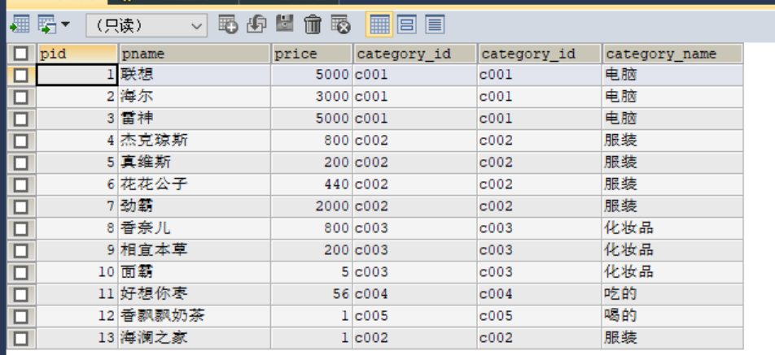
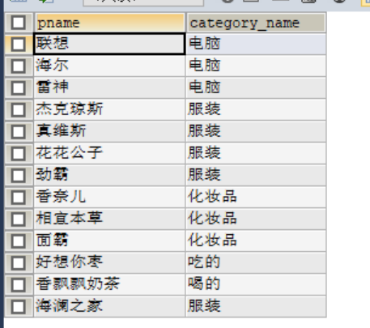
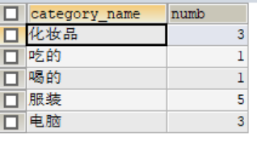
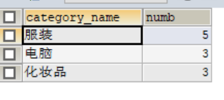
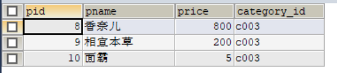

## 多表关系与查询

### 1、多表关系

- 电商数据库
  - 用户表
    - 用户id、用户名称、用户手机……
  - 商品表
    - 商品id、商品名称、商品价格、库存、尺寸……
  - 订单表
    - 订单id、用户id、商品id、总金额、支付方式
- 员工数据库
  - 员工表
    - 员工id、员工姓名、员工性别、年龄、部门id……
  - 部门表
    - 部门id、部门名称、部门位置、部门领导……
  - 员工和部门之间的关系
    - 员工属于某一个部门

- 表与表之间通过某些列来实现关联，表现数据之间的关系

  

### 2、join

- 功能：通过两张表之间关联的列，实现将两张表的列进行合并

- 关键字：A    **join** B   **on**  条件

- 语法

  ```sql
  select 查询的两张表的哪些列  from A表  join  B表  on 关联条件;
  ```

- 本质：通过某种列的关系，将两张表的列进行了关联

- 需求1：查询每个商品的名称以及所属分类的名称

  - 分析结果长什么样？

    ```
    商品名称			分类名称
    联想					电脑
    ……
    weiC 100			 吃的
    ```

  - 问题：商品名称 属于商品表，分类名称属于分类表

  - 关系：分类id：categor_id

  - 查询

    ```sql
    --将商品表与分类表通过分类id进行关联，并显示两张表的所有列
    select
       a.*,
       b.*
    from
       product as a join category as b on a.category_id = b.category_id;
    ```

    

    ```sql
    select
      a.pname,
      b.category_name
    from
      product a join category b on a.category_id = b.category_id;
    ```

    

    

- 需求2：统计每个分类名称对应的商品个数

  ```sql
  select
    b.category_name,
    count(*) as numb
  from
    product a join category b on a.category_id = b.category_id
  group by
    b.category_name;
  ```

  

  

- 需求3：统计除了吃的分类以外的所有分类的商品个数，并显示个数最多的前三个分类

```sql
select 
   b.category_name,
   count(*) as numb
from 
   product a join category b on a.category_id = b.category_id
where
   b.category_name != '吃的'
group by
   b.category_name
order by
   numb desc
limit 3;
```





- 分类

  - inner join：内连接，inner可以省略

    - 关联条件中，两张表都有这个值，结果就有
    - 类似于集合中两个集合的交集

  - left outer join：左外连接，outer可以省略

    - 关联条件中，左表中有，结果就有

    - 类似于集合中左表的全集

      ```sql
      select
        a.pname,
        b.category_name
      from
        product a left join category b on a.category_id = b.category_id;
      ```

      - 左表是product，右表是category
      - 如果product表中有一条数据的category_id是c006，而category中没有
      - 结果有

  - right   outer join：右外连接，outer可以省略

    - 关联条件中，右表中有，结果就有

    - 类似于集合中右表的全集

      ```sql
      select
        a.pname,
        b.category_name
      from
        product a right join category b on a.category_id = b.category_id;
      ```

      - 左表是product，右表是category
      - 如果category表中有一条数据的category_id是c006，而product中没有
      - 结果有

  - full   join：全连接

    - 关联条件中，两张表任意一边有，结果就有
    - 类似于集合中的两张表全集

  


### 3、子查询

- 功能：在select语句中嵌套select语句

- 需求1：查询化妆品这个分类对应的所有商品信息

  - 分析结果长什么样？
    - 所有商品信息：product
  - 条件：化妆品这个分类对应的商品
    - 化妆品：category
  - 解决：先获取化妆品对应的分类id，然后根据分类id到商品表中查询这个分类id对应的商品

  ```sql
  select category_id from category where category_name = '化妆品';
  select * from product where category_id = 'c003';
  ```

  

  ```sql
  select * from product where category_id = (select category_id from category where category_name = '化妆品');
  ```

  - 先执行内层的SQL语句
  - 然后执行外层的SQL语句

  

  

- 需求2：查询相宜本草对应的分类的名称

  - 结果：显示分类的 名称：category
  - 条件：相宜本草  pname：product

  ```sql
  #--先查询相宜本草对应的分类id
  select category_id from product where pname = '相宜本草';
  #--根据分类id到分类表中查询分类的名称
  select category_name from category where category_id = 'c003';
  |
  select category_name from category where category_id = (select category_id from product where pname = '相宜本草');
  ```

  

- join与子查询的应用场景

  - 如果你的查询结果包含多张表的列
    - join
  - 如果你的查询结果只有一张表的列，条件来自于别的表
    - 子查询


