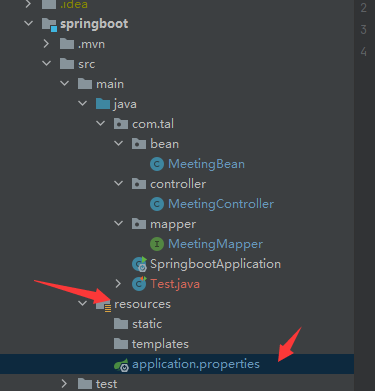

## SpringBoot 概述

**SpringBoot 概念**

SpringBoot提供了一种快速使用Spring的方式，基于约定优于配置的思想，可以让开发人员不必在配置与逻辑业务之间进行思维的切换，全身心的投入到逻辑业务的代码编写中，从而大大提高了开发的效率，一定程度上缩短了项目周期。2014 年 4 月，Spring Boot 1.0.0 发布。Spring的顶级项目之一(https://spring.io)。


**SpringBoot 功能**

**1） 自动配置**

Spring Boot的自动配置是一个运行时（更准确地说，是应用程序启动时）的过程，考虑了众多因素，才决定Spring配置应该用哪个，不该用哪个。该过程是SpringBoot自动完成的。

**2） 起步依赖**

起步依赖本质上是一个Maven项目对象模型（Project Object Model，POM），定义了对其他库的传递依赖，这些东西加在一起即支持某项功能。简单的说，起步依赖就是将具备某种功能的坐标打包到一起，并提供一些默认的功能。

**3） 辅助功能**

提供了一些大型项目中常见的非功能性特性，如嵌入式服务器、安全、指标，健康检测、外部配置等


**小结**

SpringBoot提供了一种快速开发Spring项目的方式，而不是对Spring功能上的增强。

Spring的缺点：

-  配置繁琐

- 依赖繁琐

SpringBoot功能：

-  自动配置 
- 起步依赖：依赖传递
- 辅助功能

## 快速入门

结合demo：搭建SpringBoot工程，定义HelloController.hello()方法，返回”Hello SpringBoot!”。

步骤：

① 创建Maven项目

② 导入SpringBoot起步依赖

③ 定义Controller

④ 编写引导类

⑤ 启动测试

```xml
<!--springboot 工程需要继承的父工程 -->
<parent>
		<groupId>org.springframework.boot</groupId>
		<artifactId>spring-boot-starter-parent</artifactId>
		<version>2.1.8.RELEASE</version>
</parent>
<dependencies>
    <!--web开发的起步项-->
    <dependency>
		<groupId>org.springframework.boot</groupId>
		<artifactId>spring-boot-starter-web</artifactId>
	</dependency>
</dependencies>


```


SpringBoot连接数据库

先配置数据库连接



```properties
spring.datasource.driverClassName = com.mysql.cj.jdbc.Driver
spring.datasource.url = jdbc:mysql://localhost:3306/bigdata?serverTimezone=UTC&useUnicode=true&characterEncoding=utf-8
spring.datasource.username = root
spring.datasource.password = root
```

测试

```java
package com.tal;
/*
    author: Tal
    TODO: 
*/

import org.junit.jupiter.api.Test;
import org.springframework.beans.factory.annotation.Autowired;
import org.springframework.boot.test.context.SpringBootTest;

import javax.sql.DataSource;


@SpringBootTest
class Test1 {

    @Autowired
    DataSource dataSource;

    @Test
    void contextLoads() throws Exception{
        System.out.println("获取的数据库连接为:"+dataSource.getConnection());
    }

}
```

