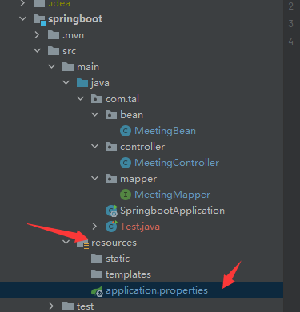

## SpringBoot 概述

**SpringBoot 概念**

SpringBoot提供了一种快速使用Spring的方式，基于约定优于配置的思想，可以让开发人员不必在配置与逻辑业务之间进行思维的切换，全身心的投入到逻辑业务的代码编写中，从而大大提高了开发的效率，一定程度上缩短了项目周期。2014 年 4 月，Spring Boot 1.0.0 发布。Spring的顶级项目之一(https://spring.io)。


**SpringBoot 功能**

**1） 自动配置**

Spring Boot的自动配置是一个运行时（更准确地说，是应用程序启动时）的过程，考虑了众多因素，才决定Spring配置应该用哪个，不该用哪个。该过程是SpringBoot自动完成的。

**2） 起步依赖**

起步依赖本质上是一个Maven项目对象模型（Project Object Model，POM），定义了对其他库的传递依赖，这些东西加在一起即支持某项功能。简单的说，起步依赖就是将具备某种功能的坐标打包到一起，并提供一些默认的功能。

**3） 辅助功能**

提供了一些大型项目中常见的非功能性特性，如嵌入式服务器、安全、指标，健康检测、外部配置等


**小结**

SpringBoot提供了一种快速开发Spring项目的方式，而不是对Spring功能上的增强。

Spring的缺点：

-  配置繁琐

- 依赖繁琐

SpringBoot功能：

-  自动配置 
- 起步依赖：依赖传递
- 辅助功能

## 快速入门

结合demo：搭建SpringBoot工程，定义HelloController.hello()方法，返回”Hello SpringBoot!”。

步骤：

① 创建Maven项目

② 导入SpringBoot起步依赖

③ 定义Controller

④ 编写引导类

⑤ 启动测试

```xml

<!--springboot 工程需要继承的父工程 -->
<parent>
		<groupId>org.springframework.boot</groupId>
		<artifactId>spring-boot-starter-parent</artifactId>
		<version>2.1.8.RELEASE</version>
</parent>
<dependencies>
    <!--web开发的起步项-->
    <dependency>
		<groupId>org.springframework.boot</groupId>
		<artifactId>spring-boot-starter-web</artifactId>
	</dependency>
</dependencies>


```

```java
package com.tal.controller;
/*
    author: Tal
    TODO: 
*/

import org.springframework.web.bind.annotation.RequestMapping;
import org.springframework.web.bind.annotation.RestController;

@RestController     // =@Controller + @ResponseBody // 表示该类是SpringBoot的一个Controller ，且返回的数据为JSON格式
public class testController {

    @RequestMapping("/hello")   // 响应地址
    public String hello(){
        return "Hello SpringBoot!";
    }
}

```

```java
package com.tal;

import org.springframework.boot.SpringApplication;
import org.springframework.boot.autoconfigure.SpringBootApplication;

/**
 *  引导类 SpringBoot项目的入口
 */

@SpringBootApplication
public class SpringbootApplication {

    public static void main(String[] args) {
        SpringApplication.run(SpringbootApplication.class, args);
    }

}

```

**小结**

- SpringBoot在创建项目时，使用jar的打包方式。

- SpringBoot的引导类，是项目入口，运行main方法就可以启动项目。

- 使用SpringBoot和Spring构建的项目，业务代码编写方式完全一样。

## SpringBoot 起步依赖原理分析

**起步依赖原理分析**

**1） spring-boot-starter-parent**

**2） spring-boot-starter-web**

**小结**

- 在spring-boot-starter-parent中定义了各种技术的版本信息，组合了一套最优搭配的技术版本。 

- 在各种starter中，定义了完成该功能需要的坐标合集，其中大部分版本信息来自于父工程。

- 我们的工程继承parent，引入starter后，通过依赖传递，就可以简单方便获得需要的jar包，并且不会存在版本冲突等问题。

## SpringBoot 配置

### **配置文件分类**

SpringBoot是基于约定的，所以很多配置都有默认值，但如果想使用自己的配置替换默认配置的话，就可以使用application.properties或者application.yml（application.yaml）进行配置。


**小结**

-  SpringBoot提供了2种配置文件类型：properteis和yml/yaml

-  默认配置文件名称：application

-  在同一级目录下优先级为：properties > yml > yaml

### YAML 

**基本语法**


数据格式


参数引用

```yaml
name: lisi
person:
name: ${name} # 引用上边定义的name值
```

小结


### 读取配置内容

@value


Environment


引用变量多的时候使用environment只需要一次注入

@ConfigurationProperties


@Component 表示能被Spring所读取的Bean


## SpringBoot整合其他框架

### 整合Junit

```java
// 起步依赖里已经添加了

@RunWith(SpringRunner.class)    // 最新版的不需要了
@SpringBootTest(classes = SpringbootTestApplication.class)

@Test
```

### 整合MyBatis

① 搭建SpringBoot工程

② 引入mybatis起步依赖，添加mysql驱动

③ 编写DataSource和MyBatis相关配置

```properties
spring.datasource.driverClassName = com.mysql.cj.jdbc.Driver
spring.datasource.url = jdbc:mysql://localhost:3306/bigdata?serverTimezone=UTC&useUnicode=true&characterEncoding=utf-8
spring.datasource.username = root
spring.datasource.password = root
```


④ 定义表和实体类

```java
package com.tal.bean;
/*
    author: Tal
    TODO: 
*/

import lombok.AllArgsConstructor;
import lombok.Data;
import lombok.NoArgsConstructor;

import javax.persistence.*;

@Data
@NoArgsConstructor
@AllArgsConstructor
@Table(name = "meeting_base")
public class MeetingBean {
    @Id
    private String meeting_index;                               // 会议编号
    @Column(name = "meeting_category")
    private String meeting_category;                            // 会议类型
    @Column(name = "meeting_member")
    private String meeting_member;                              // 会议规模
    @Column(name = "meeting_level")
    private String meeting_level;                               // 会议规格
    @Column(name = "meeting_feature")
    private String meeting_feature;                             // 会议特性
    @Column(name = "meeting_scope")
    private String meeting_scope;                               // 影响范围
    @Column(name = "meeting_income")
    private float meeting_income;                               // 会议收入
    @Column(name = "meeting_sponsor")
    private float meeting_sponsor;                              // 会议赞助
    @Column(name = "meeting_time")
    private float meeting_time;                                 // 会议时长
    @Column(name = "meeting_area")
    private String meeting_area;                                // 会议地域
    @Column(name = "meeting_guestLevel")
    private String meeting_guestLevel;                          // 嘉宾规格
    @Column(name = "meeting_commutingCost")
    private float meeting_commutingCost;                        // 通勤开支
    @Column(name = "meeting_foodCost")
    private float meeting_foodCost;                             // 餐厅开支
    @Column(name = "meeting_comprehensiveCost")
    private float meeting_comprehensiveCost;                    // 综合开支
    @Column(name = "meeting_foodNum")
    private int meeting_foodNum;                                // 餐饮安排次数
    @Column(name = "meeting_hotelNum")
    private int meeting_hotelNum;                               // 住宿酒店个数
    @Column(name = "meeting_busNum")
    private int meeting_busNum;                                 // 公车接待车次
    @Column(name = "meeting_satisfaction")
    private String meeting_satisfaction;                        // 会议满意度
}

```


⑤ 编写dao和mapper文件/纯注解开发

```java
package com.tal.mapper;
/*
    author: Tal
    TODO: 
*/

import com.tal.bean.MeetingBean;
import org.apache.ibatis.annotations.Mapper;
import org.apache.ibatis.annotations.Select;
import org.springframework.stereotype.Component;

import java.util.List;

@Mapper
@Component
public interface MeetingMapper {

    @Select("select * from meeting_base")
    public List<MeetingBean> findAll();


}

```


⑥ 测试

```java
package com.tal;

import com.tal.bean.MeetingBean;
import com.tal.mapper.MeetingMapper;
import org.junit.jupiter.api.Test;
import org.springframework.beans.factory.annotation.Autowired;
import org.springframework.boot.test.context.SpringBootTest;

import java.util.List;

@SpringBootTest
class SpringbootApplicationTests {
    @Autowired
    private MeetingMapper meetingMapper;
    @Test
    public void testFindAll() {
        List<MeetingBean> list = meetingMapper.findAll();
        System.out.println(list);
    }

}

```


SpringBoot连接数据库

先配置数据库连接



```properties
spring.datasource.driverClassName = com.mysql.cj.jdbc.Driver
spring.datasource.url = jdbc:mysql://localhost:3306/bigdata?serverTimezone=UTC&useUnicode=true&characterEncoding=utf-8
spring.datasource.username = root
spring.datasource.password = root
```

测试

```java
package com.tal;
/*
    author: Tal
    TODO: 
*/

import org.junit.jupiter.api.Test;
import org.springframework.beans.factory.annotation.Autowired;
import org.springframework.boot.test.context.SpringBootTest;

import javax.sql.DataSource;


@SpringBootTest
class Test1 {

    @Autowired
    DataSource dataSource;

    @Test
    void contextLoads() throws Exception{
        System.out.println("获取的数据库连接为:"+dataSource.getConnection());
    }

}
```

