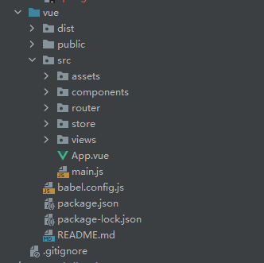

Vue和Springboot分别是前后端的框架，目前使用的功能主要是后端通过将数据抛出，前端获取数据并显示，不涉及前端交互后返回数据给后端

思路为，在Springboot的controller层将数据抛出到对应的路由，再由前端截取相应路由的数据进行后续操作




转换数组，将多属性数组中的某个属性单拎出来成为新的数组

```js
let meeting_category = res.data.map((item)=>{
              return item.meeting_category;
```

过滤，提取数组中需要的数据

```js
let hyhy = meeting_category.filter((item)=>{
              return item === "行业会议"
            }).length;
```


js里异步需要时间响应，所以异步请求后的语句也可以在他前面执行

```js
axios.get(this.apiUrl)
        .then((res) => {          
        }).catch(err => console.error(err))
console.log(res); // 可能先执行


const res = await axios.get(this.apiUrl)
console.log(res); // 后执行 
```


案件关联、分类、地点信息、身份信息、趋势预测