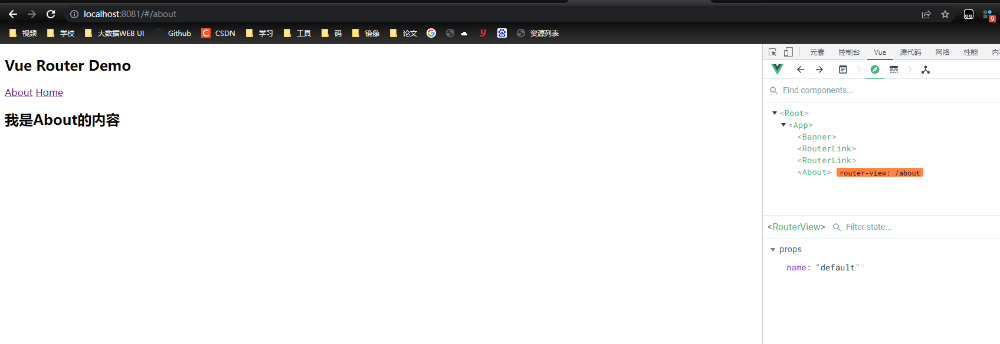

## vue实现页面切换

路由的搭建, 先引入vue-router

```js
// router/index.js
// 该文件专门用于创建整个应用的路由器
import VueRouter from 'vue-router'
//引入组件
import About from '../pages/About'
import Home from '../pages/Home'
import News from '../pages/News'
import Message from '../pages/Message'

//创建并暴露一个路由器
export default new VueRouter({
	routes:[
		{
			path:'/about',
			component:About
		},
		{
			path:'/home',
			component:Home,
			children:[
				{
					path:'news',
					component:News,
				},
				{
					path:'message',
					component:Message,
				}
			]
		}
	]
})

```

```js
// main.js

//引入Vue
import Vue from 'vue'
//引入App
import App from './App.vue'
//引入VueRouter
import VueRouter from 'vue-router'
//引入路由器
import router from './router'

//关闭Vue的生产提示
Vue.config.productionTip = false
//应用插件
Vue.use(VueRouter)

//创建vm
new Vue({
	el:'#app',
	render: h => h(App),
	router:router
})

```

建立路由组件

```vue
<template>
	<div>
		<h2>Home组件内容</h2>
		<div>
			<ul class="nav nav-tabs">
				<li>
					<router-link class="list-group-item" active-class="active" to="/home/news">News</router-link>
				</li>
				<li>
					<router-link class="list-group-item" active-class="active" to="/home/message">Message</router-link>
				</li>
			</ul>
			<router-view></router-view>
		</div>
	</div>
</template>

<script>
	export default {
		name:'Home',
		/* beforeDestroy() {
			console.log('Home组件即将被销毁了')
		}, */
		/* mounted() {
			console.log('Home组件挂载完毕了',this)
			window.homeRoute = this.$route
			window.homeRouter = this.$router
		},  */
	}
</script>
```

调用路由

```vue
<template>
  <div>
    <div class="row">
      <Banner/>
    </div>
    <div class="row">
      <div class="col-xs-2 col-xs-offset-2">
        <div class="list-group">
					<!-- 原始html中我们使用a标签实现页面的跳转 -->
          <!-- <a class="list-group-item active" href="./about.html">About</a> -->
          <!-- <a class="list-group-item" href="./home.html">Home</a> -->

					<!-- Vue中借助router-link标签实现路由的切换 -->
					<router-link class="list-group-item" active-class="active" to="/about">About</router-link>
          <router-link class="list-group-item" active-class="active" to="/home">Home</router-link>
        </div>
      </div>
      <div class="col-xs-6">
        <div class="panel">
          <div class="panel-body">
						<!-- 指定组件的呈现位置 -->
            <router-view></router-view>
          </div>
        </div>
      </div>
    </div>
  </div>
</template>

<script>
	import Banner from './components/Banner'
	export default {
		name:'App',
		components:{Banner}
	}
</script>

```



